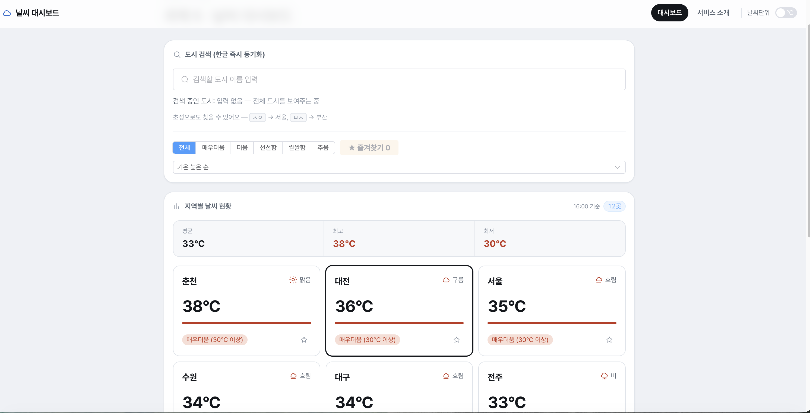
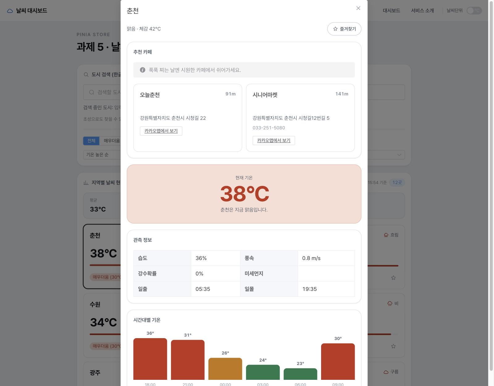

# 날씨 대시보드 (skala-vue)

Vue 3 + Composition API 로 만든 날씨 대시보드 과제입니다. 국내 12개 도시의 실시간 날씨를 보여주고,
지역 카드를 클릭하면 모달로 상세 관측 정보 + 주변 카페 추천(Kakao 로컬 API)까지 확인할 수 있습니다.

- **저장소**: https://github.com/hxxnjoon/skala-vue
- **배포 링크**: https://hxxnjoon.github.io/skala-vue/
  (레포 Settings → Pages → Source 를 "Deploy from a branch" / `gh-pages` 브랜치로 최초 1회 켜야 위 주소가 뜹니다.
  아래 [배포 방법](#배포-github-pages) 참고)

## 스크린샷

| 대시보드 | 상세보기 모달 |
|---|---|
|  |  |

> `docs/screenshots/` 에 `dashboard.png`, `detail.png` 두 장을 넣고 커밋하면 위 표에 바로 나타납니다.

## 구현한 기능

- **도시 검색 (한글 · 초성)** — `서울`은 물론 `ㅅㅇ`으로도 즉시 필터링됩니다.
- **5단계 기온 분류** — 매우더움(30℃↑) · 더움(25 ~ 29℃) · 선선함(20 ~ 24℃) · 쌀쌀함(15 ~ 19℃) · 추움(15℃↓)을
  색상환에서 고르게 떨어뜨린 색으로 구분해 카드 태그·게이지·필터·상세 모달 전체에서 일관되게 씁니다.
- **정렬 · 필터** — 기온순/이름순 정렬, 기온 구간 필터, 즐겨찾기만 보기를 조합할 수 있습니다.
- **지역 카드 클릭 → 상세보기 모달** — 별도 버튼 없이 카드 자체가 상세보기 진입점입니다. 페이지 전체를
  옮기지 않고 모달로 뜨지만, 주소는 `/#/weather/:cityId` 로 바뀌어 새로고침·직접 URL 접속·뒤로 가기가
  모두 정상 동작합니다.
- **주변 카페 추천** — 상세보기 모달을 열 때마다 그 도시 주변 카페 중 2곳을 무작위로 추천합니다
  (Kakao 로컬 API, 날씨에 따라 추천 문구도 달라짐).
- **즐겨찾기** — Pinia 스토어로 전역 관리, `localStorage` 에 저장되어 새로고침해도 유지됩니다.
- **섭씨 / 화씨 전환** — 내비게이션 바의 스위치 하나로 목록·통계·상세 모달이 함께 바뀝니다(Pinia).
- **로딩 · 에러 처리** — 날씨/카페 조회 실패를 구분해서 보여줍니다. 날씨 자체가 실패하면 전체를,
  카페만 실패하면 그 영역만 에러로 표시하고 나머지 정보는 그대로 유지합니다.
- **UI 라이브러리(Element Plus)** — 입력·선택·다이얼로그·태그·스켈레톤·빈 상태 등 전반에 적용하고,
  프로젝트 색 토큰에 맞춰 테마를 재정의했습니다.

## 기술 스택

Vue 3 · Composition API (`<script setup>`) · Vue Router · Pinia · Element Plus · Axios · Vite ·
OpenWeatherMap API · Kakao 로컬 API · ESLint / oxlint

## 실행 방법

### 1. 설치

```sh
npm install
```

### 2. 환경 변수 설정

`.env.example` 을 복사해 `.env.local` 을 만들고 실제 키를 채워 넣습니다.

```sh
cp .env.example .env.local
```

```
VITE_OPENWEATHER_API_KEY=발급받은_OpenWeatherMap_키
VITE_OPENWEATHER_BASE_URL=https://api.openweathermap.org/data/2.5
VITE_KAKAO_REST_API_KEY=발급받은_Kakao_REST_API_키
```

- OpenWeatherMap: https://openweathermap.org/api 에서 무료 키 발급
- Kakao: https://developers.kakao.com → 애플리케이션 추가 → **앱 키 > REST API 키** 발급 →
  반드시 **제품 설정 > 카카오맵**을 활성화해야 검색이 동작합니다(기본값은 꺼져 있음).

`.env.local` 은 `.gitignore` 의 `*.local` 규칙에 걸려 저장소에 올라가지 않습니다.

### 3. 개발 서버

```sh
npm run dev
```

### 4. 빌드

```sh
npm run build
```

`dist/` 에 정적 파일이 생성됩니다. `vite.config.js` 의 `base: '/skala-vue/'` 는 GitHub Pages 프로젝트
페이지 경로에 맞춘 값이라, 다른 이름의 저장소로 배포한다면 이 값을 저장소 이름에 맞게 바꿔야 합니다.

### 5. 린트

```sh
npm run lint
```

## 배포 (GitHub Pages)

Node.js 런타임 없이 정적 파일만으로 호스팅되도록, 빌드 결과(`dist/`)를 `gh-pages` 브랜치에 올리고
GitHub Pages 가 그 브랜치를 그대로 서빙하는 방식을 씁니다.

```sh
npm run deploy
```

위 명령은 `vite build` 로 `dist/` 를 만든 뒤 `gh-pages` 패키지로 그 내용을 `gh-pages` 브랜치에
푸시합니다(`.env.local` 의 키가 빌드 시점에 그대로 번들에 들어갑니다). 저장소를 새로 만들었다면
**최초 1회** GitHub 저장소의 **Settings → Pages → Build and deployment → Source** 를
"**Deploy from a branch**" 로, 브랜치를 "**gh-pages / (root)**" 로 지정해야 합니다. 이후 `npm run deploy`
를 다시 실행할 때마다 같은 주소로 갱신됩니다.

라우터가 `createWebHashHistory` (해시 라우팅)를 쓰기 때문에 `/about`, `/weather/seoul` 같은 하위 주소를
직접 입력하거나 새로고침해도 서버 쪽 리라이트 설정 없이 정상 동작합니다.

## 체크리스트 자가 점검

| 항목 | 상태 | 비고 |
|---|---|---|
| 반응형 상태·computed·watch/watchEffect 로 검색·필터링 | ✅ | `WeatherHomeView.vue` — `searchQuery`/`tempFilter`/`sortKey` 등 ref, `filteredWeatherList`/`summary` computed, 상태바·탭 제목 갱신에 watch/watchEffect 사용 |
| 4개 컴포넌트 분리 + props/emit | ✅ | `BaseDashboardCard`·`SearchBar`·`WeatherCard` 는 그대로, 최상위 조립 컴포넌트는 라우팅이 필요해지면서 `WeatherParent.vue`(1일차 산출물, 저장소에 남아 있음) → `WeatherHomeView.vue` 로 이름이 바뀌었습니다. 역할(부모가 상태를 들고 자식은 props/emit 만 쓰는 구조)은 동일합니다. |
| Vue Router로 목록 ↔ 상세 화면 이동 | ✅ | 상세보기는 화면상 모달이지만, `router.push({ name: 'weather-detail', params: { cityId } })` 로 주소가 `/#/weather/:cityId` 로 바뀌고 그 파라미터로 모달을 엽니다. 새로고침·직접 URL 접속·브라우저 뒤로 가기 모두 라우터가 처리합니다. |
| Pinia로 즐겨찾기 등 전역 상태 분리 | ✅ | `stores/favoritesStore.js`(즐겨찾기), `stores/configStore.js`(단위) |
| Axios로 실제 API 연동 (로딩·에러 처리 포함) | ✅ | `api/client.js`(OpenWeatherMap), `api/placeClient.js`(Kakao) — 도메인별 axios 인스턴스 + 공통 `ApiError`, 로딩/에러/재시도 UI |
| UI 라이브러리(Element Plus) 적용 | ✅ | 전역 등록 + 테마 색 재정의(`main.css`), 폼/다이얼로그/태그/스켈레톤/빈 상태 등에 적용 |
| Vite 빌드 후 정상 배포 (base 경로 확인) | ✅ | `vite.config.js` 에 `base: '/skala-vue/'` 설정, `gh-pages` 브랜치로 배포 |

## 4일간 어려웠던 점과 해결 과정

- **한글 IME 입력과 반응형 검색** — `v-model` 은 한글 조합이 끝나야 값이 갱신돼서, 타이핑 중간 글자가
  화면에 바로 안 보이는 문제가 있었습니다. `:value` + `@input` 으로 네이티브 input 이벤트를 직접 받아
  해결했습니다. 이후 Element Plus `el-input` 으로 바꾸면서 같은 문제가 다시 발생했는데 — `el-input` 이
  내부적으로 조합 중엔 자기 `input` 이벤트를 막아 두기 때문이었습니다. `el-input` 이 감싸고 있는 실제
  `<input>` DOM 을 `ref` 로 직접 잡아 네이티브 리스너를 별도로 붙여서 우회했습니다.
- **Element Plus 커스텀 색이 안 먹는 문제** — 온도 등급 태그에 직접 지정한 배경색이 계속 Element Plus
  기본 파란색으로 보였습니다. 알고 보니 `.el-tag.el-tag--primary` 처럼 Element Plus 자체 CSS 규칙도
  클래스 2개짜리라 제가 만든 규칙과 우선순위가 같았고, 로드 순서에 따라 밀리고 있었습니다. 실제로 쓰는
  `.el-tag--light` 클래스까지 셀렉터에 포함시켜(클래스 3개) 확실히 이기도록 고쳤습니다.
- **외부 API 요청이 실패 이유별로 다르게 옴** — 키 오류(401), 요청 한도 초과(429), 네트워크 끊김이 전부
  다른 처리를 필요로 했습니다. `axios` 인터셉터에서 원본 에러를 화면이 바로 쓸 수 있는 `ApiError`(문구 +
  재시도 가능 여부)로 한 번에 변환해 두고, 컴포넌트는 `error.message`/`error.retryable` 만 보게 만들어
  화면마다 같은 분기를 반복하지 않게 했습니다. Kakao API는 추가로 "REST 키는 있는데 지도 서비스가 앱에서
  꺼져 있어" 403 이 나는 경우가 있어서, 실제 키로 직접 호출해 에러 메시지를 확인하고 나서야
  "제품 설정 > 카카오맵 활성화"가 빠졌다는 걸 알아냈습니다.
- **모달로 바꾸고 나니 Vue Router 요구사항과 충돌** — 상세보기를 페이지 이동 대신 모달로 바꾸고 나니
  주소가 안 바뀌어서, "Router 로 목록 ↔ 상세 이동"이라는 앞선 과제 요구사항을 더는 만족하지 못하게
  됐습니다. `/weather/:cityId` 라우트를 다시 두되 같은 `WeatherHomeView` 컴포넌트를 가리키게 하고, 그
  라우트 파라미터를 모달의 열림 여부·대상 도시로 그대로 쓰는 방식(주소가 유일한 출처)으로 바꿔서 모달
  UX 와 라우터 기반 이동을 동시에 만족시켰습니다. 이 과정에서 "주소창에 상세 주소를 직접 입력해 처음부터
  열린 채로 마운트되는 경우"는 `el-dialog` 의 `@open` 이벤트가 안 잡는다는 걸 알게 돼서, `@open`/`@closed`
  이벤트 대신 `modelValue`/`cityId` 를 직접 지켜보는 `watch(..., { immediate: true })` 로 바꿔 두 경우
  모두 커버했습니다.
- **무작위 추천이 실제로 무작위인지 확인하기** — 카페 2곳을 무작위로 뽑는 로직을 짜 놓고도, 같은 도시를
  반복해서 열어보면 계속 같은 2곳만 나오는 것처럼 보이는 순간이 있었습니다. 알고 보니 테스트 중 모달을
  자동으로 닫고 여는 스크립트가 실제로는 닫히지 않은 채 같은 상태를 반복 조회하고 있었던 것이었고,
  실제 클릭으로 여러 번 열고 닫아 보니 매번 다른 조합이 나오는 걸 확인했습니다.

## 프로젝트 구조 메모

과제가 여러 날에 걸쳐 누적되면서 초기 연습 파일(`components/exercise/WeatherParent.vue`,
`WeatherComposition.vue`, `WeatherMockup.vue` 등)은 라우팅에서 빠졌지만 진행 과정을 보여주기 위해
저장소에 남겨 두었습니다. 실제 서비스되는 화면은 `views/WeatherHomeView.vue`(대시보드) ·
`views/WeatherAboutView.vue`(소개) · `components/exercise/CityDetailDialog.vue`(상세보기 모달) 세
곳을 중심으로 구성되어 있습니다.
